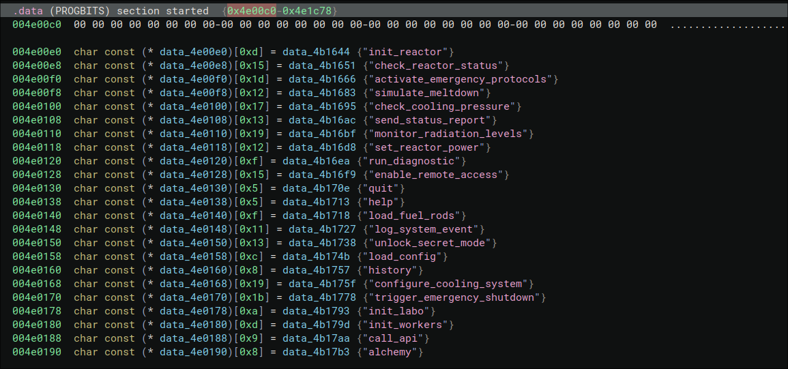

# Vulnerability: Privilege Escalation / Harcoded functions 

## Flag : {SHUTDOWN} 

Severity: Critical  

Location: obsidian binary in data (PROGBITS)  

Discovered in: Reverse Engineering (Blackbox)  

 

Description:  

The binary analysis revealed that the list of commands displayed by the help function is incomplete. The program contains a Dispatch Table.  

Some of these entries, such as trigger_emergency_shutdown, are intentionally omitted from the user interface but remain active in the code. This command is protected by a privilege flag that requires prior elevation.  

  

Technical Analysis:  

Through reverse engineering, we identified that the sub_4034a8 function is recorded at index 18 (0x12) in the order table.  

Although the help stops visually before, the parser still accepts this entry.  

Access condition: The function checks the data_4e1ce8 variable. If it is 1, activated via emergency protocols, the flag is issued.  

  

PoC:  

    Obtain administrative rights: activate_emergency_protocols -> admin123.  

    Enter the undocumented command: trigger_emergency_shutdown.  

    The reactor initiates its shutdown procedure and displays the flag: {SHUTDOWN}.  

 

Impact:  

 

DoS : A user capable of discovering this command can force an immediate and unplanned shutdown of the nuclear power plant, resulting in a blackout or hardware damage to the turbine.  

 

Patch: 

Physically delete functions and names of debug/emergency commands from production binaries.  

All critical control commands must be documented and protected by authentication rather than mere concealment. 

