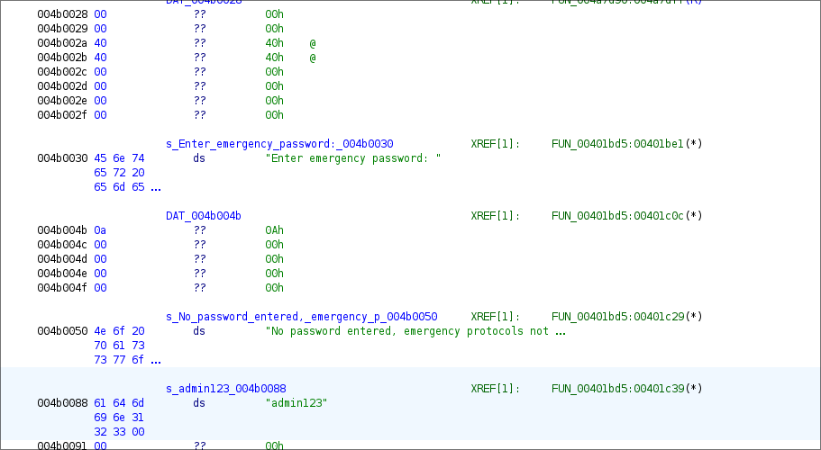

# Vulnerability: Hardcoded Administrative Credentials 

## Flag: {Emergency protocols activated, you are now admin !} 

Severity: Critical 

Type: Broken Access Control / Hardcoded Credentials 

Location : FUN_00401bd5 

Discover in : Black box 

Description:  

 

00401c3e: MOV RDI, RAX  

corresponds to retrieving the user name. 

00401c39: MOV ESI, s_admin123_004b0088  

corresponds to a strcmp-type string comparison.  

The password is therefore written in hard-coded form in the binary source code,  

and a simple chain comparison.  

 

PoC:  

1. Execute the binary: . /obsidian  

2. enter help for the list of valid orders  

3. enter "activate_emergency_protocols", this one asks for an administrator password  

4. Open the binary in Ghidra  

5. Do a global "password" search  

6. Understand the above logic of comparison and chain in the binary  

7. Return to the executed binary and enter the plaintext password found  

8. Validate the entry  

 

Impact:  

Privilege Escalation. This vulnerability allows any individual with the binary to obtain administration rights over the reactor. This can lead to a total takeover of security systems and the triggering of a nuclear meltdown.  

 

Remediation:  

The program must never store a private key (such as a password) in plain text in the source code, so it would have to implement a hash function like SHA-256, because this one is in a single direction; once modified, it is theoretically not possible to trace back to its input. To prevent the attacker from possibly using tables with known lists of hashed passwords, it is important to use the salt (magic number):  

 

Hash(Password + Salt) 

The best in a real case would be to use an API that processes the password.  

The client enters a password and the API decides whether or not the password is valid.
  